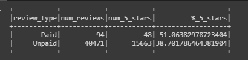

# Amazon Vine Analysis: examining bias in paid vine reviews versus unsolicited, unpaid reviews

## Overview
## Results
1) There were 94 Vine reviews and 40,471 Non-Vine reviews
2) There were 48 5-star Vine reviews and 15,663 Non-Vine 5-star reviews
3) 51% of the Vine reviews were 5-stars and 39% of the Non-Vine reviews were 5-stars

**Table 1:**  Analysis output table.  Vine reviews are labled as "Paid," while Non-Vine Reviews are labeled as "Unpaid."

## Summary

